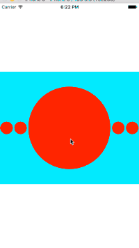

# CollectionCustomLayout
使用collectionview实现视图效果，采用自定义Layout的方法布局

提供参数可以自定义视图样式

1. bigItemScaleSmallItem 决定大球和小球的宽度比例
2. smallItemCountOneSide 决定大球一边的小球个数

mark：更多自定义layout的demo学习，可拜访[这里](https://github.com/dsxNiubility/SXPhotoShow)
