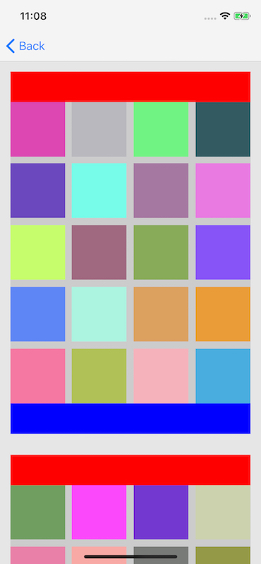
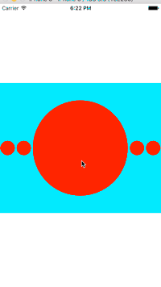
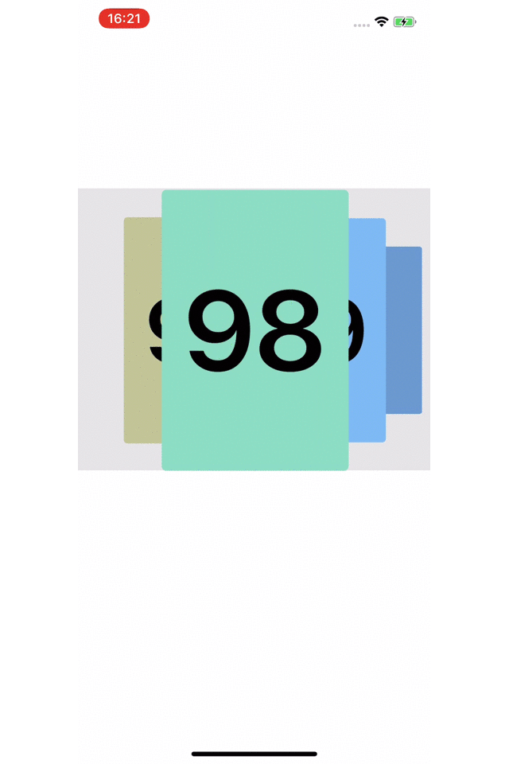

# CollectionCustomLayout
学习使用collectionview自定义Layout的方法布局

demo有3个

 * demo1 - 基础流式布局，可作为layout实现的模板
 * demo2 - 大小球滚动效果
 * demo3 - 使用第三方库iCarousel，实现卡片层叠轮播滚动效果

### demo1

基础流式布局，可作为layout实现的模板
包含基础的 SupplementaryView 和 DecorationView 的使用

### demo2

提供参数可以自定义视图样式

1. bigItemScaleSmallItem 决定大球和小球的宽度比例
2. smallItemCountOneSide 决定大球一边的小球个数

### demo3

使用 iCarousel 制作的 卡片层叠轮播 效果

iCarousel地址：[iCarousel](https://github.com/nicklockwood/iCarousel)

